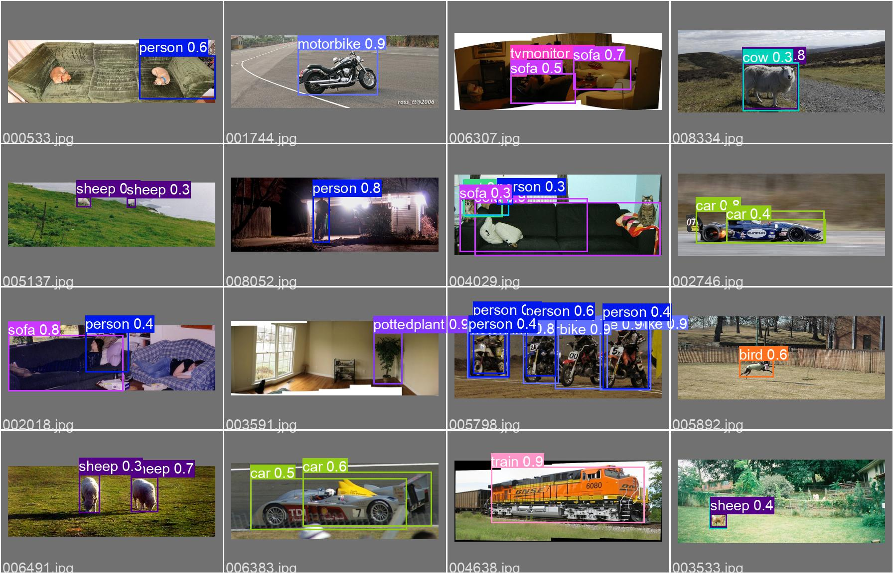

# Mid-term Homework

### 1. Train Res50


### 2. Train YOLOv3



1. install dependences (python>=3.6.0, Pytorch>=1.7)

```
$ git clone https://github.com/John-8911797110/machine-learning-and-neural-network.git
$ cd mid_hw/yolov3
$ pip3 install -r requirements 
```

2. begin training

```
$ python3 train.py --img 416 --batch 64 --epochs 100 --data data/voc2007.yaml 
--weights yolov3-tiny.pt --devices 0,1,2,3
```

3. inference

```
$ python detect.py --source path/*.jpg  # glob
```


### 3. Train Faster-rcnn 

1. install dependences

```
$ cd mid_hw/faster-rcnn-pytorch
$ pip3 install torch==1.2.0
$ pip3 install -r requirements.txt
```

2. train

```
python3 train.py
```

3. inference

```
python predict.py
```

